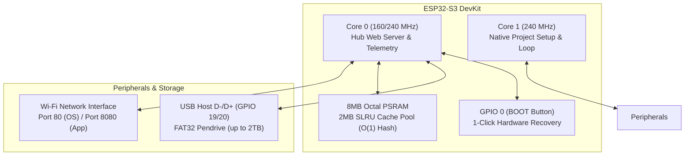

# ESP32-S3 Storage & Memory Hub OS

> **A High-Performance, Multi-Tiered Memory Manager, USB Mass Storage Host & Dynamic Dual-OTA Application Hub for ESP32-S3 Microcontrollers.**

[](https://platformio.org/)
[](https://docs.espressif.com/projects/esp-idf/)
[](LICENSE)

---

## Key Architectural Highlights

* **USB Mass Storage Host**: Native FAT32/exFAT pendrive support up to 2TB connected directly to ESP32-S3 USB Host pins (**GPIO 19/20**).
* **Segmented SLRU PSRAM Manager**: 512-page 2MB active PSRAM cache pool using **Segmented Least Recently Used (SLRU)** caching with an **O(1) Hash Map Index** to accelerate file throughput up to **8x**.
* **End-to-End Performance Architecture**:
  * **16 KB High-Speed TCP Buffers**: Optimized chunked transfer streams for high throughput file transfers.
  * **Zero Heap Fragmentation**: Pre-allocated JSON string buffers to prevent dynamic heap fragmentation on Core 0.
  * **HTTP Static Caching**: 24-hour immutable asset caching (`Cache-Control: public, max-age=86400`).
  * **Visibility-Aware Polling**: Intelligent browser tab visibility debouncing to pause background requests when tabs are inactive.
* **Interactive Deletion Progress Modal**: Real-time percentage progress bar (`0% -> 100%`) with spam-proof mutex locking (`isActionBusy`) for single file/folder and multi-select batch deletions.
* **Dynamic Real-Time Dashboard**: 100% live telemetry cards tracking USB storage capacity, SLRU cache hit rates, internal SRAM, 8MB OPI PSRAM allocator, IP network status, and live serial streams over REST APIs.
* **Fast Dual-OTA Partition Switcher**: Seamless `<1.5s` partition switching between Core OS (`ota_0`) and User Firmware (`ota_1`).
* **Dual-Port Web Architecture**:
  * **Port 80**: Central OS Control Dashboard, WebDAV Windows Drive (`\\192.168.0.8\STORAGE`), and Live Serial Console.
  * **Port 8080**: Independent project web application interfaces.

---

## Hardware Pinout & Architecture



### Hardware Connections Table

| ESP32-S3 Pin | Function | Description |
| :--- | :--- | :--- |
| **GPIO 19** | `USB D-` | USB Host Data Negative |
| **GPIO 20** | `USB D+` | USB Host Data Positive |
| **GPIO 0** | `BOOT Button` | Hold 1s to trigger hardware rollback to `ota_0` Core OS |
| **GPIO 2** | `LED_BUILTIN` | Standard onboard status indicator LED |
| **GPIO 48** | `RGB_BUILTIN` | WS2812 RGB NeoPixel diagnostic LED |

---

## Quick Start & Installation

### 1. Build and Flash Core OS (`ota_0`)

Requires [PlatformIO CLI](https://platformio.org/) or VS Code Extension:

```bash
# Clone the repository
git clone https://github.com/Lalitkishore2/S3-Storage-Hub-OS.git
cd S3-Storage-Hub-OS/"usb based s3"

# Build Core OS firmware
pio run

# Flash Core OS to ota_0 (0x10000)
pio run --target upload
```

### 2. Prepare USB Pendrive

Format any USB pendrive to **FAT32** and create the following directory structure:

```text
USB Drive Root (/)
├── apps/               <-- Store compiled project binaries (.bin)
│   └── esp32_s3_reset_code.bin (Default Starter Firmware)
├── www/                <-- Static website hosting (index.html)
└── data/               <-- App data files & logs
```

### 3. Connect to Web Dashboard

Open your web browser and navigate to:
```text
http://storage.local/   (or http://192.168.0.8/)
```

---

## Integrating Any Project (`StorageHubApp`)

To make any PlatformIO or Arduino C++ project compatible with Storage Hub OS, simply include `storage_hub_app.h`:

```cpp
#include <Arduino.h>
#include "storage_hub_app.h"

void setup() {
    Serial.begin(115200);

    // Initialize non-intrusive background framework on Core 0
    StorageHubApp::init("My Awesome Project");
    StorageHubApp::log("[APP] System online and ready!");
}

void loop() {
    // Non-blocking loop yield
    StorageHubApp::loop();

    // Your native hardware logic runs on Core 1 at full speed
    static unsigned long lastLog = 0;
    if (millis() - lastLog > 2000) {
        lastLog = millis();
        
        // Read/Write files to USB pendrive safely
        StorageHubApp::Storage::appendFile("/data/sensors.log", "25.4,60\n");
    }
}
```

---

## Default Starter Test Code (`esp32_s3_reset_code`)

The repository includes `esp32_s3_reset_code` as the official **Default Installation Firmware**. It provides:
1. RGB NeoPixel cycle test (Red -> Green -> Blue).
2. Live hardware diagnostic stream to Port 80 Hub Console.
3. Instant NVS clear and `ota_0` Core OS restoration test.

---

## License

This project is open-source under the **MIT License**.
